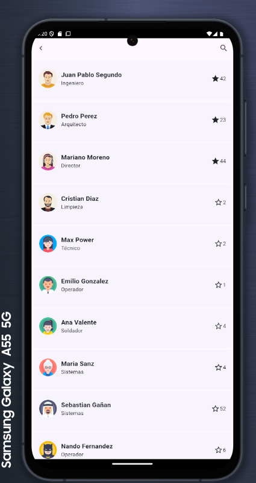

 # Hello!!, I'm Sergio Antozzi

<table align="center">
<tr border="none">
<td width="50%" align="center">
  
  
    
  
</td>

<td width="50%" align="center">

  
  
  </td>
</tr>
</table>

| 
  
**The Best Buy**               |
|------------------------------------------------------------------------------|
| 🔹 **Description:** Project for lab 4, it is a full stack of nodejs and Flutter, done as a team. It uses an api created with NodeJs which connects to Platzi fake strore api.|
| 🛠️ **Technologies:** `Flutter`|
| 🌐 **Repository:** [Link to Demo](https://github.com/santozzi/lab4tp2) |
| 💡 **Installation:** `flutter pub get`  |
|   30% ✨ **Versión:** 1.0 |                          

| 
  
**Popcornia**                 |
|------------------------------------------------------------------------------|
| 🔹 **Description:** Project that provides information about movies, you can search by year, by protagonist and by title, it provides information about the cast of the selected movie and a trailer of it. This web site connects to the API TMDB|
| 🛠️ **Technologies:** `ReactJs`, `TMDB`, `Javascript`,`CSS`|
| 🌐 **Demo:** [Link to Demo](https://santozzi.github.io/popcornia/) |
| 💡 **Installation:** `npm install`  |
|   ✨ **Versión:** 1.0 |                          

| 
  
**Busca Caracoles**                 |
|------------------------------------------------------------------------------|
| 🔹 **Description:** "Busca caracoles" is a clone of Minesweeper, but the blank spaces are snails and the mines are spiders.Use recursive search to find the joined snails. |
| 🛠️ **Technologies:** `ReactJs`, `Typescript`,`CSS`| |
| 🌐 **Demo:** [Link to Demo](https://santozzi.github.io/buscacaracoles/) |
| 💡 **Installation:** `npm install`  |
|   ✨ **Versión:** 1.0 |

| 
  
**Pokedex**                 |
|------------------------------------------------------------------------------|
| 🔹 **Description:** Project that uses the pokeapi API to display a pokemon encyclopedia. It is responsive, changing the presentation type depending on the size of the device. |
| 🛠️ **Technologies:** `ReactJs`, `Typescript`,`CSS`,`Pokeapi`| |
| 🌐 **Demo:** [Link to Demo](https://santozzi.github.io/pokedex/) |
| 💡 **Installation:** `npm install`  |
|   ✨ **Versión:** 1.0 |

        
<!--- stats (end) -->

<!--h1 without bottom border-->

  <ul align="center">
    
<h2 style="display: inline-block">Technologies That I Know👨🏻‍💻</h2>

  </ul>

<!--tech stack icons-->

   

>

<!-- Connect with me -->
<!--h2 without bottom border-->

  <ul align="center">
    
<h2 style="display: inline-block">Connect With Me🤝</h2>

  </ul>

<!--icons and links-->

  

<!--horizontal divider(gradiant)-->

----------------------------------------------------------------------

